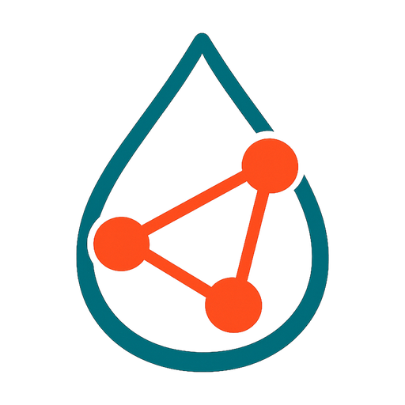
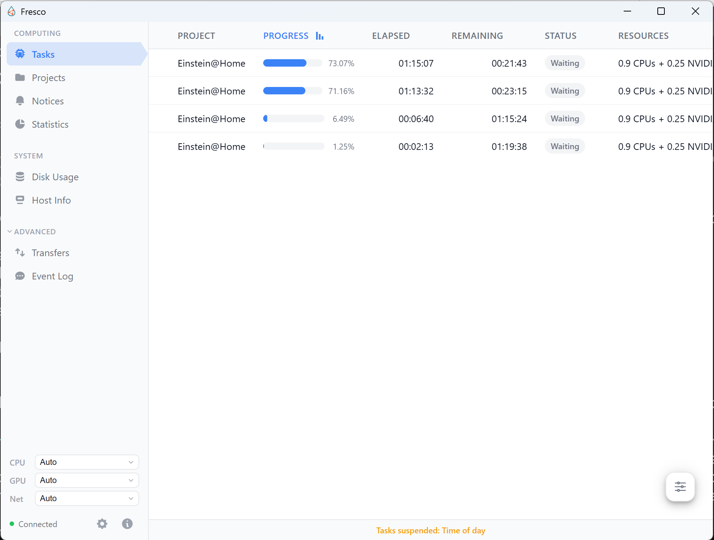

  

<h1 align="center">Fresco</h1>

  A fast, lightweight BOINC Manager that just works. 
  One portable binary. No installer. Windows, macOS, and Linux.

  

Requires [BOINC](https://boinc.berkeley.edu/download.php) to be installed.

## Install

  
  
  

See the **[Installation](https://github.com/AufarZakiev/Fresco/wiki/Installation)** wiki page for downloads and platform-specific notes.

## Contributing

See the **[Contributing](https://github.com/AufarZakiev/Fresco/wiki/Contributing)** wiki page for how to report bugs, request features, or build from source.

## License

